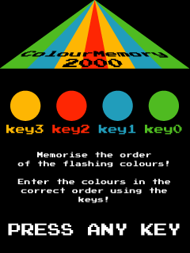

201158825 Thariq Fahry Mini-Project

## Overview
ColourMemory2000 is a game that tests your memory!

## Folder structure
| Path                       | Purpose |
| ---                        | --- |
| `Mini-Project.v`| Top-level module |
| `ip/`| IP used in this project |
| `simulation/`| Simulation code |
| `graphics/`| Background graphics and .mif renderer |
| `output_files/MiniProject.cdf`| JTAG Chain Description file |
| `README.md`                | This file |

## Gameplay
Memorise the colours as they appear.  
Press the keys in the correct order!  
The sequence length increases with each level.  

## State machine table

|     State name    |     Encoding    |     Next State (Correct key)     |  Next State (Incorrect key)|     Output      (LCD pixels)    |     Output      (7-segment)    |
|-------------------|-----------------|--------------------|----------------------|---------------------------------|--------------------------------|
|     INTROST       |     000         |     SEQGENST       |                      |     Intro graphic               |     Blank                      |
|     SEQGENST      |     001         |     MEMORIZST      |                      |     Black                       |     Blank                      |
|     MEMORIZST     |     010         |     GAMEST         |                      |     Cycle through colours       |     Blank                      |
|     GAMEST        |     011         |     WINST          |     GAMEOVERST       |     Last pressed colour         |     Blank                      |
|     GAMEOVERST    |     100         |     INTROST        |                      |     Game over graphic           |     Final score                |
|     WINST         |     101         |     SEQGENST       |                      |     Level complete graphic      |     Score so far               |
|     KEYPRESSST    |     110         |     nextState      |                      |     Does not change             |     Does not change            |

# Demo

      

